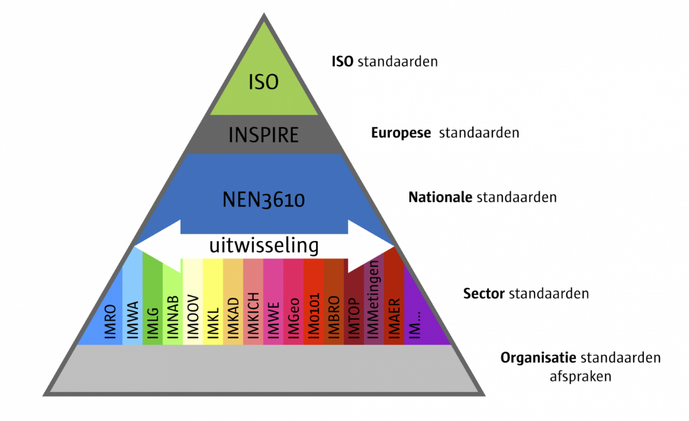

Domeinmodel 
------------

 

IMROI betreft een sectormodel, vallend onder de nationale standaard NEN 3610 en
Europese standaard INSPIRE.  

 

 

 

## Identificatie van objecten
De in NEN 3610 gedefinieerde object-identificatie is voor externe referentie en identificatie van objecten
(van buiten naar een object binnen een registratie) in tegenstelling tot de
interne object-identificatie (binnen een registratie). Uitgangspunt is dat
objecten over registraties heen uniek identificeerbaar zijn. Om dit te bereiken is de
object-identificatie opgebouwd uit een landencode (conform ISO 3166-1
Landencodes, uniek op mondiaal niveau), een namespace waarmee de
bronhouder/registratie wordt aangeduid (uniek binnen Nederland) en een interne
object-identificatie (uniek binnen een registratie/bronhouder). Eventueel kan
dit nog aangevuld worden door een uniek versienummer binnen één interne
object-identificatie. 

 

NEN 3610 hanteert de volgende regels voor een identifier: 

-   Een IdentificeerbaarObject heeft een unieke object-object-identificatie
    binnen het domein van NEN 3610. 

-   De object-identificatie is voor identificatie van een object (een
    representatie in een database van een fenomeen in de werkelijkheid). De object-identificatie is niet voor
    identificatie van het fenomeen zelf. 

-   Object-identificatie is voor externe referentie van het object. 

-   De NEN 3610 object-identificatie wordt gepubliceerd door de
    bronhouder/beheerder en mag gebruikt worden voor externe
    object-identifcatie. Binnen een registratie mag een interne
    object-identificatie voorkomen die anders luidt en die bedoeld is voor
    unieke identificatie. 

-   Tijdens de hele levensloop van een object blijft de
    object-identificatie gelijk. 

-   Objecten kunnen in hun levensloop van eigenschappen veranderen maar de
    object-identificatie moet gelijk blijven. 

-   Als een attribuutwaarde verandert dan leidt dat tot een nieuwe versie. Een
    registratie kan besluiten of een object een nieuwe versie identificatie
    krijgt. 

-   Versie object-identificatie is geen onderdeel van de unieke
    object-identificatie. Indien er verschillende versies van een object bestaan
    hebben die dezelfde namespace en lokaalID. Versies van een geo-object geven
    de ontwikkeling van een geo-object in zijn levensloop weer. 

-   Verandering van het attribuut eindRegistratie leidt niet tot een nieuwe
    versie van een Object. 
